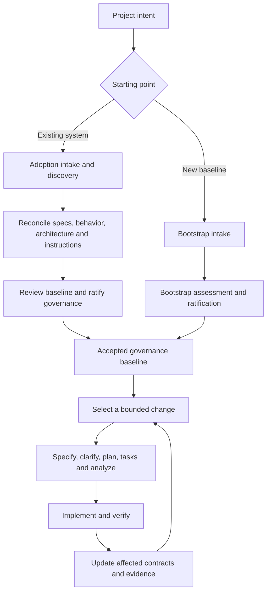

# Adopting Program Kit in an existing repository

**Status: Deferred — input for a future official intake.** Tracked as
[PK-ARCH-002 in the architecture backlog](architecture-backlog.md#pk-arch-002-adopt-program-kit-in-an-existing-repository).
This preliminary proposal is retained for when the user chooses to begin that intake. Its workflow,
contracts, and implementation increments remain recommendations to evaluate then; no intake or
implementation is currently scheduled. The repository-coherence requirement clarified after the
initial analysis is included below and must be carried into that intake.

Program Kit should offer a dedicated **adoption workflow** that establishes a trustworthy, explicitly scoped baseline for an existing system and connects its next changes to the normal governed delivery lifecycle. Its promise should be: understand the system sufficiently to change it safely, reconcile the rules that govern those changes, and preserve the evidence behind every consequential conclusion.

The recommended public name is `program-kit-adopt`. Intake remains the conversational method shared by bootstrap and adoption. Bootstrap establishes a new project's intended baseline; adoption reconciles an inherited baseline. Both should eventually produce a common governance contract consumed by specification, planning, tasks, analysis, and implementation.

This is a design proposal. Proposed commands, record types, states, paths, and integration behavior below are not implemented capabilities. The analysis applies to existing repositories generally; the concrete implementation findings refer to the inspected Program Kit source revision recorded in the sources.

**The product boundary.** Adoption should make a repository governable without requiring its architecture to become the Program Kit reference architecture. Installing governance, accepting rules, and adopting managed runtime components are separate decisions. A mature application should be able to keep its framework, deployment topology, authentication system, package manager, and test conventions while gaining traceability and governed change.

**What already exists.** The repository is closer to supporting adoption than a clean-repository description suggests. The README permits existing source, documentation, and Spec Kit initialization. However, it also says initialization can refresh files owned or scaffolded by Spec Kit. Installation compatibility does not establish semantic adoption or guarantee that instruction files survive unchanged. [^1]

The current intake already distinguishes explicit answers, defaults, proposals, unresolved questions, and deferred decisions. It supports a canonical architecture map, evidence links, draft validation, confirmation, and selective re-analysis. Its discovery policy deliberately avoids broad repository exploration, which is appropriate for its present purpose but insufficient for adoption. [^2]

The workflow then performs assessment, research, constitution ratification, architecture, tooling, roadmap, final approval, and readiness. It preserves review packets and hash-bound authority. Those mechanisms are valuable foundations. The mismatch is in what they assume they are establishing. [^3]

| Existing mechanism | Useful for adoption | Required change |
| --- | --- | --- |
| Conversational intake | Resolve ambiguity and retain corrections | Begin with inherited evidence and current goals; add bounded code discovery |
| Default adoption | Avoid unnecessary tool-selection questions | Preserve established choices by default and classify compatibility separately |
| Canonical architecture map | Stable identities, traceability, C4 projections | Distinguish observed structure, endorsed constraints, and proposed changes |
| Ratified constitution | Explicit project governance | Support inherited authority, effective scope, and bounded exceptions |
| Specification roadmap | Sequence future vertical outcomes | Keep inherited capability history distinct from future work |
| Lifecycle and ownership checks | Prevent stale or conflicting plans | Consume a baseline originating from either bootstrap or adoption |
| Managed file reconciliation | Preview, drift detection, interrupted-write recovery | Generalize carefully for governance artifacts and instruction ownership |

These gaps are visible in executable contracts. `governance_state.py` knows bootstrap-specific assessment, decision, approval, and completion paths; bootstrap completion requires a Ready roadmap entry. `architecture-check` asks for bootstrap decision evidence and instructs recovery through bootstrap. The default assessment chooses the Foundation host for .NET unless explicitly opted out, while ownership validation reads that bootstrap choice. Adding only a new prompt would leave these dependencies intact. [^4][^5][^6]

**Why a separate workflow is the better fit.** Four approaches are plausible, with different costs:

| Approach | Advantage | Main limitation | Recommendation |
| --- | --- | --- | --- |
| Extend bootstrap with an existing-repository flag | Small public API change and immediate reuse | Divergent discovery, defaults, history, and completion semantics spread through every stage | Reuse its mechanisms internally; keep a separate public workflow |
| Convert all code and documents into fresh Program Kit specs | Superficially uniform output | Large up-front effort, duplicated authority, invented certainty, and rapid staleness | Reserve comprehensive reconstruction for a separately requested deliverable |
| Apply governance only to the next change | Fast path to immediate value | Can leave conflicting instructions and shared constraints unexamined | Use its bounded depth within a reviewed repository baseline |
| Dedicated adoption converging on shared governance | Honest treatment of inherited evidence and one downstream lifecycle | Requires baseline and rule-applicability refactoring | Recommended product architecture |

The separate entry point should not become a permanent fork of governance. Its distinct responsibilities end when the accepted baseline is available. Specification and delivery then use the same rules for freshness, authority, ownership, and verification, with applicability determined by the adopted scope and profiles.

**The central distinction: evidence and authority.** Existing code tells us what an implementation appears to do. Tests show what was exercised under particular conditions. Specifications describe intended or recorded behavior. Instructions direct developers and agents. None of these is automatically authoritative for every question.

A newer file does not necessarily supersede an older approved decision. A green test can preserve an accidental behavior. An implemented feature can violate its specification. A production runbook may describe an emergency workaround that should never become a general development rule.

The adoption model should therefore record separate dimensions rather than one overloaded confidence or completion status:

| Dimension | Question it answers | Example values, proposed |
| --- | --- | --- |
| Provenance | Where did this claim come from? | Existing spec, code, test, ADR, instruction, maintainer answer |
| Implementation evidence | What have we established about the system? | Observed statically, exercised, reported externally, unknown |
| Governance authority | Has the team endorsed this requirement or constraint? | Imported claim, confirmed current requirement, accepted decision, disputed |
| Disposition | What should happen next? | Preserve, clarify, verify, repair, replace, retire |
| Scope and freshness | Where and when is the claim usable? | Service, contract, revision, environment, source hashes |

For example, “the refund endpoint permits duplicate submissions” might be statically observed, confirmed by a test, and rejected as intended behavior. Adoption should retain that evidence, record the defect, and constrain the next change accordingly. It must not convert the observation into an acceptance criterion merely because it is reproducible.

**How much discovery is enough.** Use broad structural discovery and selective behavioral depth. Inventory the selected repository or product area, but deeply trace only the critical shared boundaries and the first intended change. Discovery is complete when the remaining uncertainty is visible and does not prevent that scope from being governed.

Repository-wide instruction entry points, solution/workspace manifests, CI definitions, contract locations, spec stores, and deployment descriptions are cheap and useful to inventory. Reading every source file and reconstructing every historical feature is expensive and gives a misleading impression of completeness. A scanning budget should report its exclusions and unread areas; reaching a budget must never be recorded as complete coverage.

This direction agrees with Spec Kit's current existing-project guidance: establish a reviewable baseline, capture real guardrails, and govern a bounded next change. That guidance explicitly distinguishes initialization from inferring specifications. OpenSpec similarly recommends growing specification coverage through actual changes. Program Kit needs a stronger treatment of inherited specifications than treating all old documents as background: an approved SRS or contract can remain active authority in its original location. [^11][^12]

**The proposed workflow, from first conversation to delivery.** The stages below describe responsibilities and resumable checkpoints. They should not become a fixed questionnaire or require approval for every discovered fact.

**1. Establish the adoption mandate.** Start with why the team wants Program Kit now, the product or services in scope, the first intended outcome, the people authorized to settle conflicts, and what must remain compatible. Infer stack and repository layout from files. Ask about business intent, acceptable behavior changes, inaccessible sources, and organizational ownership.

A useful opening synthesis is: “This is an existing order-management application. We will preserve its current hosting and identity arrangements, reconcile the order specifications and agent instructions, and prepare the export change for governed delivery.” The team can correct that statement before substantial analysis.

Scope may be the whole repository, one deployable service, or a bounded product area. Record other areas as outside the current adoption scope. For a shared database or library, scope must include the relevant consumers and compatibility obligations even when their implementation is not being adopted.

**2. Capture a source baseline before initialization.** Discovery must be usable before installing Program Kit into the target. Otherwise initialization can alter the instruction and scaffold files whose original state adoption needs to understand.

Provide a release-owned, read-only discovery tool that runs against a target and writes its inventory to a separate output location. It should record the Git revision, working-tree changes, relevant untracked sources, tool versions, selected scope, source hashes, instruction candidates, and likely destination collisions. Never automatically stash, reset, or commit the team's work. Analysis can proceed on a dirty tree if its evidence accurately records those bytes; mutation requires a stable, reviewable basis for all affected paths.

The inventory is a map of evidence, not a copy of the repository. Use bounded reads, exclude build outputs and vendored dependencies by policy, and make inaccessible files explicit. Do not follow symlinks, junctions, submodules, includes, or local paths beyond the declared roots without a deliberate scope decision. Do not ingest secrets or private agent memory into shared project artifacts.

Keep installation and outer workflow execution in a human-owned terminal, consistent with the current execution boundary. A future installer preview must account for integration files and mandatory hooks as well as ordinary copied files. The existing initializer is not a read-only adoption scanner. [^1][^2]

**3. Build an evidence inventory and reconcile existing specs.** Discover specifications, ADRs, README material, diagrams, API schemas, migration definitions, tests, CI checks, release notes, and repository-local AI instructions. Preserve original paths and identifiers. External tickets or documents can be linked or imported through explicitly available access, with revision and access limitations recorded.

Produce a capability register organized around actors and observable outcomes. Relate those capabilities to original requirement identifiers, code entry points, tests, contracts, and unresolved discrepancies. Avoid deriving a capability taxonomy entirely from folder names; a folder often reflects implementation convenience rather than a business boundary.

For each inherited specification, decide whether it is a living requirement, a historical change proposal, an architectural design, an abandoned draft, or a mixed document. A completed checklist is evidence of a historical claim, not proof of current implementation or deployment.

**4. Reconstruct the current system at useful depth.** Begin with people, external systems, executable applications, stores, and deployment boundaries. Trace the first proving journey through entry point, authorization, business effect, persistence, external calls, failure outcomes, and observable result. Expand into adjacent code when a shared boundary makes it necessary.

Record actual dependency direction, shared-store access, ambiguous ownership, and exceptions. If the code is a layered monolith, show that structure honestly. Candidate domain boundaries can coexist as hypotheses; they should not make the current implementation look more modular than it is.

C4 supports retrospective documentation and separates system context, containers, components, and code. Use those abstraction levels for physical structure and the Program Kit strategic model for domain ownership. A deployable service, a namespace, and a bounded context need not correspond one to one. [^13]

**5. Resolve consequential conflicts through adaptive intake.** Present the conflicting sources, the affected behavior, the likely consequences, and a recommendation. Ask only the owner who can answer. Preserve earlier answers and reopen only dependent questions when a correction changes the evidence.

An example: “The approved API spec promises a single refund, but the handler and tests allow a duplicate. Is duplicate rejection still required?” If yes, record a defect and its compatibility implications. If policy has changed, record the new decision and supersession. If the answer is unknown, block refund-changing work without preventing unrelated adoption work.

Use the existing shipped interview method's dependency ordering and correction handling, with an adoption-specific branch policy. The end product is a concise reconciliation review: established facts, accepted intentions, disputed claims, retained conventions, proposed exceptions, and the next change. [^2]

**6. Ratify governance that can operate on this repository.** Draft or amend the constitution from inherited authority and confirmed decisions. Keep enforceable rules compact. Existing organization policies or an already ratified constitution are inputs with real authority; do not silently replace them with Program Kit defaults.

If the existing constitution is accepted unchanged and has valid supported evidence, reuse that authority. If its text, scope, or applicability changes, use the amendment and ratification process. A historical “ratified” label without verifiable provenance is imported evidence requiring present confirmation, not a reason to fabricate an old receipt or date.

Record the effective governance scope. Separate rules applicable immediately to all in-scope work, rules applying to new or changed behavior, and time-bounded exceptions for specific inherited violations. “Everything under legacy is exempt” is too broad to govern a real change.

Program Kit's current accepted decision puts architecture and tooling authoring after ratification. Adoption requires explicit clarification that pre-ratification discovery describes existing evidence and proposes decisions; it does not accept a new architecture. Any change to that policy belongs in a reviewed contributor ADR. [^7]

**7. Assemble and activate the adoption baseline.** After ratification, finalize the endorsed architecture constraints, current-state map, requirement links, instruction reconciliation, verification baseline, exceptions, and future-work roadmap. Stage the artifacts, generate a precise diff, validate references and applicability, then present the activation review.

Activation makes the reviewed governance baseline available to subsequent lifecycle checks. It actively reorganizes the in-scope repository artifacts when needed: create, move, merge, split, update, replace, archive, or delete files and repair their consumers. The default write set includes specifications, governance documents, instructions, workflow configuration, and the references needed to connect them. Necessary source/build reference edits caused by an approved move belong in the same plan and require relevant verification. Runtime migrations and unrelated application refactoring remain their own changes.

**8. Prove the connection with one real change.** Choose a small feature, bug fix, or compatibility-preserving improvement that exercises a meaningful user outcome. The first specification must identify what changes, which behavior remains fixed, the inherited requirements it touches, and the verification needed before implementation.

Then use the normal specification, clarification, planning, task, analysis, implementation, and verification lifecycle. Preserve its existing blockers and evidence checks. Adoption is useful only if the resulting repository can complete that cycle without inventing bootstrap history or bypassing incompatible rules.

**9. Maintain the baseline incrementally.** Each later change updates affected requirement mappings, architecture facts, instruction rules, exceptions, and verification evidence. Refresh dependencies from changed sources rather than asking the team to reconfirm the whole repository. A document move should preserve identity; a semantic correction should reopen the claims that depend on it.

**Existing specifications need reconciliation, not bulk conversion.** Start by registering each source's role, authority, original identifiers, revision, and owner. Retain a complete source document even if only a subset is analyzed. Report coverage for that subset; a claim such as “all requirements mapped” needs a defined denominator.

Use evidence categories that do not falsely equate code presence with completion:

| Inherited requirement situation | Adoption treatment | Future-work treatment |
| --- | --- | --- |
| Current requirement, matching implementation, relevant passing evidence | Preserve and link the evidence with its environment and scope | No implementation task merely to recreate the record |
| Implementation found, behavior not exercised | Mark implementation observed and verification unknown | Add verification only where risk or planned work warrants it |
| Requirement partially implemented | Identify the supported portion and exact gap | Create a bounded change for the missing behavior |
| Requirement contradicts code or tests | Keep both claims and route a decision | Repair behavior or revise the requirement through explicit authority |
| Code exists without a written requirement | Record a discovered capability and provisional behavior description | Confirm consequential rules before modifying them |
| Spec has been superseded or abandoned | Preserve history and link the replacement or disposition | Exclude it from active acceptance criteria |
| Source or deployment cannot be inspected | Record the limitation and reported claims separately | Restrict readiness only where the missing evidence matters |

The roadmap should remain the authority for future change status. Store inherited capability and verification status in a separate register. Do not create fake `Delivered` roadmap entries that imply historical work passed Program Kit gates. Existing Spec Kit feature directories retain their IDs and lifecycle history; an active feature entering governance needs fresh review of its current artifacts, not rerunning implementation from the beginning or copying old approvals into new receipts.

Preserve the meaning, authority, and identity of existing living requirements while choosing a maintainable canonical location. Keep a source in place when the actual skills and workflows can consume it there; otherwise move or reconcile it into the supported structure and update its consumers. Keep completed change packages as historical records where they have a defined retention purpose. When a change alters a living contract, update that contract and its mapping in the same reviewed change. Where no living contract exists, create a focused one only when there is enough reviewed evidence and a maintenance owner. Avoid maintaining a second full copy merely to satisfy a preferred folder structure.

A source registry should express which document owns each requirement. Two imported documents can both contribute context, but they must not independently own contradictory versions of the same active requirement. If ownership is unresolved, record the conflict rather than choosing by filename or modification time.

**AI instruction reconciliation is a migration of meaning.** Inventory root and nested `AGENTS.md` and override files, `CLAUDE.md`, applicable rule directories, Copilot instructions, Cursor or other editor instructions, agent skills, prompts, repository-local settings, and executable hooks. Read named imports under the allowed scope. Preserve unsupported formats as evidence with a diagnostic.

Distinguish instructions automatically loaded by an agent from documents merely linked for later reading. Distinguish instruction text from executable settings or hook code. A useful report must answer both “what rules exist?” and “what is likely to be loaded for this agent, working directory, and target path?”

Tool semantics differ. Codex documents a root-to-working-directory discovery chain, one selected file per directory, override filenames, and a combined byte budget. Claude documents `CLAUDE.md`, imports, and path-scoped rules; its native loading is not equivalent to Codex's. Copilot supports repository-wide and path-specific instructions, with support depending on the product surface. A universal concatenation algorithm would erase those differences. [^14][^15][^16]

The scanner's output is a predicted loading model for recorded tool versions and configuration, not proof of what an arbitrary running session consumed. Organization and personal instructions outside the repository may still influence a session. Record declared external influences or a visibility limitation without copying private material into a shared artifact. Critical controls should be enforced by validators, permissions, or CI where feasible, with prose explaining their use.

Extract candidate rules with stable IDs, original source ranges and hashes, applicability, owner, rationale, and proposed disposition. Human review should focus on consequential meaning changes, not approving each obvious duplicate separately.

| Rule type | Preferred destination or treatment |
| --- | --- |
| Durable project governance | Constitution or an explicitly governed policy |
| Accepted architecture constraint | Existing ADR and architecture authority |
| Build, test, and contributor procedure | Maintained contributor guide; short agent-facing instruction |
| Service- or path-specific rule | Scoped instruction at equivalent applicability |
| Task-specific workflow | Skill or command invoked when relevant |
| Tool-specific requirement | Adapter for that tool and surface |
| Historical workaround | Preserve pending verification; retire only with evidence |
| Duplicate, ambiguous, or conflicting statement | Reconcile with sources and a recorded disposition |
| Permission or executable hook configuration | Separate configuration review; never silently import as ordinary prose |

For example, a root rule saying “run all tests” and a payments rule saying “run payment tests for payment-only changes” may express valid specialization. A root prohibition on changing authorization and a nested instruction to bypass it is a consequential conflict. A global “use npm” alongside a pnpm lockfile and pnpm CI is evidence to resolve, not permission to delete one side.

After review, maintain common governance once and generate concise tool-specific entry points where necessary. A shared `AGENTS.md` can be a useful authoring location, but it is not universally loaded. A plain Markdown link is not a guaranteed import. Critical instructions must appear through each tool's supported loading mechanism; detailed references should have explicit read triggers.

Use imports where supported and generated projections where required. Track the canonical rule IDs, adapter version, source hash, scope, and emitted content hash. Scoped adapters must retain path rules and local exceptions. Do not merge unrelated tool settings, enable MCP servers, or copy executable hooks just because they are adjacent to instruction files.

Preserve recoverable original bytes before replacement. Approved retirement must remove obsolete instructions from active discovery, otherwise both old and new rules may continue to load. Use Git history or transaction backups for recovery; retain a separate historical copy only when it has a defined evidence or retention purpose, outside auto-discovered locations. Activation should recommend starting a fresh agent session so the team does not assume already-loaded guidance has changed.

Discovery also needs an execution boundary: instruction candidates encountered by the scanner are evidence, not commands for the scanner to execute. A scanner should never run repository hooks to discover them. The active assistant must still obey the instructions governing its actual session; the workflow must not claim it can override that hierarchy or retroactively make already-loaded instructions inert. When necessary, run static discovery before starting a repository-aware agent session.

**Architecture adoption should preserve physical reality and govern intended evolution.** Maintain three meanings explicitly: current structure, endorsed constraints for future work, and proposed target changes. These can share stable identities and views, but must not be presented as one undifferentiated accepted architecture.

The current map schema has statuses such as `derived`, `proposed`, and `accepted`, and it requires strategic-model information. It does not directly express all the distinctions needed for observed implementation and incomplete discovery. A supported schema evolution is preferable to hiding meaning in informal tags or inventing a bounded context solely to satisfy validation. [^6]

Import existing C4 or ADR material through supported parsers and preserve unsupported portions. Preserve accepted ADR identifiers, dates, supersession, and original rationale. If a team now decides to retain a previously undocumented architecture, record an adoption decision dated now. Do not manufacture a founding decision that pretends the choice was made years earlier.

An adoption decision should explain what is being retained, its operational constraints, known deviations, the policy for changing it, and the scope of present endorsement. “Retain the current shared schema until the billing extraction” is a valid transitional decision if ownership, risk, and the extraction trigger are explicit. It is not evidence that all current database access is good design.

**Defaults need a different applicability rule.** In bootstrap, silence can justify applying an applicable Program Kit default. In adoption, silence often means the relevant choice already exists but has not yet been described. First discover that choice, assess its evidence and compatibility, then propose a disposition.

The recommended policy is: preserve observed established choices provisionally; endorse them through the baseline review; apply Program Kit defaults only to genuinely unmade decisions within approved scope. Unknown applicability remains unknown. A compatible non-Orbyss provider should not require a migration simply to make governance usable.

Keep three independent questions visible: what technology is present, which governance rules apply, and whether Program Kit owns or manages any files or runtime components. The existing managed/guided/external capability vocabulary is useful, but it does not by itself define an adoption mode or transfer ownership. [^2][^6]

Program Kit should retain its strong recommendations. It can identify an unsupported runtime, a dependency problem, or an incompatible boundary. Recommendations become future work when accepted; they should not quietly enter the adoption write set. Selecting the managed Foundation host later invokes its full existing obligations. An adoption mode must not offer a way to claim that profile while evading its contracts. [^5][^8]

**Inherited violations require explicit, narrow exceptions.** A strict rule that instantly rejects every established project name or dependency can make adoption unusable. A blanket legacy exemption makes it meaningless. Evaluate each rule against applicability and exact inherited evidence.

An exception record should contain a rule ID, precise paths or graph edges, baseline fingerprint, rationale, accountable owner, risk, permitted change envelope, compensating verification, and expiry or a concrete review trigger. A trigger must identify who acts; “fix later” is not a usable transition plan.

Examples include retaining a known dependency edge while forbidding new consumers, or preserving a public response field while a separately tracked migration removes it. Touching the relevant boundary triggers review; it need not automatically require restructuring an entire subsystem. Conversely, adding new behavior must not expand an inherited violation invisibly.

Compare both the before and after state. Two removed violations do not offset one newly introduced violation. Classify unchanged approved exceptions separately from newly introduced or worsened findings. Do not globally lower severity, suppress HIGH/CRITICAL analysis results, or treat stale exceptions as current authority. A touched security or data-integrity defect can block that change even if unrelated adoption work proceeds.

This requires rule applicability in both deterministic checks and agent instructions. Adjusting only a schema leaves prose checks enforcing the old architecture; changing only prose leaves deterministic validators rejecting valid adopted projects. Existing managed-profile protections and lifecycle checks must retain their current meaning. [^4][^5]

**Verification establishes a usable baseline, not a certificate for the entire system.** Record relevant build and test commands, versions, environments, exits, reports, and source hashes. Distinguish passing checks, reproducible failures, flaky or inconclusive results, and checks that could not run. A missing runtime or unreachable service is a verification limitation, not automatically a product defect.

Review commands before running them because a repository's test or build script can perform network calls, migrations, or other side effects. Begin with established bounded checks in disposable test environments. Do not contact production or make deployment changes merely to complete adoption evidence.

Where behavior lacks protection, add focused characterization or contract tests as explicit follow-up work, particularly around the first change. Such tests document observations; their expected results still need review against intended behavior. The legacy-seam technique provides a useful way to isolate dependencies and introduce verification without broad restructuring. [^17]

An unrelated known failing test need not block governance activation if it has a recorded owner, stable evidence, and no impact on the proposed work. A failed acceptance check for the first change does block that change. Adoption must disclose both conditions without relabeling the entire repository green.

**Separate adoption completion from change readiness.** Use independent states so the workflow never invents work simply to satisfy a global Ready flag.

| State dimension | Proposed progression | Meaning |
| --- | --- | --- |
| Adoption session | Discovered → Reconciled → Reviewed → Activated | Evidence and governance setup for the declared scope |
| Individual change | Candidate → Ready → Active → Delivered, with Blocked/Superseded as needed | Existing roadmap lifecycle for future work |
| Verification | Known results plus unknown or unavailable areas | Evidence, scoped to checks and environments |

An adoption can be activated with no immediate feature request. Its result is “governance active; no change selected.” When a first change is selected, readiness checks its actual dependencies and boundaries. The current bootstrap completion rule requiring a Ready entry should remain a bootstrap rule, not be copied into adoption. [^4]

Do not call activation “validated in practice” until a real change has completed. That distinction lets teams finish setup honestly while giving Program Kit a useful later milestone: the first governed change delivered under the adopted baseline.

**Review gates and execution ownership.** Retain three consequential reviews: reconciliation acceptance, constitution ratification, and baseline activation. Scope clarification is an ordinary conversation. Installation is an explicit operational action in the human-owned terminal, using a previously prepared plan. Do not add a confirmation for every file or ordinary default.

| Review | What is reviewable before the decision | What the decision establishes |
| --- | --- | --- |
| Reconciliation acceptance | Scope, sources, coverage limitations, conflicts and resolutions, retained choices, proposed policy and instruction changes | The interpreted baseline is accurate enough for governance drafting |
| Constitution ratification | Exact draft, changes to inherited governance, effective scope, amendment policy, applicable exceptions | The reviewed constitution has project authority |
| Baseline activation | Final map and registers, exact instruction diff, rule applicability, verification limits, first-change status, mutation plan | This exact baseline may govern subsequent work |

Allow corrections and rejection to return to the affected stage. Regenerate the review packet when its inputs change. Reuse earlier answers when they remain valid. Existing explicit authorization can cover an unchanged plan; a new behavior-changing decision requires an updated review.

Installation creates a sequencing problem because governance hooks are currently mandatory. A design must not assume the extension can be installed harmlessly in an advisory mode. The first implementation should prepare adoption in an isolated working copy and keep shared integration changes on the adoption branch until activation is complete. Installing into an active checkout needs a supported, tested adoption-pending state and recovery behavior before it is advertised. [^5]

A pending state may enable only adoption preparation and validation; it must not claim ordinary Program Kit implementation is governed. Unrelated development can continue from the team's existing branch. Activation then introduces the accepted baseline and integration configuration together through normal review.

**Repository reconciliation must leave no unexplained artifacts in the adopted scope.** Preservation protects meaning, authority, behavior, and recoverability; it does not require keeping every old file or path. Adoption should execute the approved cleanup instead of leaving a list of suggested moves and obsolete documents beside its new outputs.

Give every discovered in-scope specification, instruction, governance, and workflow artifact a disposition. A useful disposition is one of: active canonical source, generated projection, conditional reference, retained historical evidence, merged/replaced, deleted, explicitly deferred, or outside the adopted scope. Record the owner and purpose for retained files. Record replacement identities and repair inbound references for moved, merged, or removed files. Unresolved active-authority conflicts block activation for their affected scope; deferred cleanup needs an owner and trigger and must remain visible in the completion result.

For each active artifact, identify its real consumer: the skill, workflow stage, context builder, validator, build tool, or human review procedure that uses it, together with the trigger and supported loading mechanism. A path listed in an inventory is discoverability evidence; it is not proof that a skill ever reads the file. If a workflow only accepts canonical paths, either implement and test configurable resolution or move the artifact and update its references. Do not leave an authoritative source in an unsupported location and call it integrated.

Use a consumption graph from supported entry points to authoritative inputs and derived outputs. Validate that active artifacts are reachable through declared consumers, paths resolve, generated projections are current, replacements do not leave conflicting active copies, and retired instructions no longer match automatic discovery. Check conditional references with representative stage/scope fixtures. Static checks establish routing and declared consumption, not that a model understood the content; retain that distinction in verification results. The objective is selective, reliable access, not loading every document into every session.

Ordinary application files do not all need an AI reader. Their consumers may be the compiler, runtime, tests, build, or deployment system. Historical evidence has a retrieval and retention purpose rather than an always-on instruction role. Unrelated files outside the mandate are not deletion candidates merely because Program Kit does not read them.

Git tracking and workflow consumption are independent. A tracked file can be orphaned, while a deliberately ignored generated file can have a valid consumer. Include durable adoption outputs and all moves/deletions in the reviewable change, explicitly account for previously untracked source material, and clean up transaction scratch files when recovery no longer needs them. Never equate Git-untracked status with permission to delete. Temporary, generated, and retained evidence files need explicit lifecycle policies so adoption does not create an unexplained second pile of files.

The final review must show completed dispositions, consumer/reference repairs, deliberately retained history, and outstanding scoped deferrals. Its success criterion is that every in-scope artifact has a justified role or has been reconciled away, and every active authority is connected to the flow that needs it. One reviewed mutation plan can cover the full cleanup; routine moves or deletions within that plan do not require repeated per-file approval.

**A compact artifact model.** Avoid generating a second documentation estate. Keep machine-readable canonical records, concise generated reviews, and retained sources with verified consumers. Proposed names are illustrative; schema design should validate them before implementation.

| Artifact | Ownership and purpose |
| --- | --- |
| `docs/architecture/adoption.json` | Canonical adoption record: mandate, scope, resolutions, inherited requirement/capability mappings, file dispositions and consumers, instruction dispositions, exceptions, verification summary |
| `docs/architecture/adoption-evidence.json` | Large, queryable evidence index: source IDs, revisions, locators, hashes, extraction methods, coverage and dependency links |
| `docs/architecture/architecture-map.json` | Canonical architectural content, with supported adoption semantics; existing material imported or referenced |
| Existing constitution and ADRs | Their respective governance authority; retain supported locations or migrate them with reference and consumer updates |
| Existing specification roadmap | Authority for future change status; no duplicated capability-history status |
| `docs/architecture/reviews/adoption/<baseline-id>/<stage>-review.md` | Separate retained human packet and source/diff links for each baseline revision and review stage |
| `.specify/governance/adoption-approval.json` | Immutable reviewed hashes, verdict, scope, and activation basis |
| `.program-kit/adoption-state.json` | Mutable checkpoint and recovery state; references authority without owning it |
| Tool-native instruction files | Reviewed projections or maintained scoped files, with ownership and drift tracking |

One structured authoring input can drive the adoption record and human projections, following the existing intake builder's approach. Do not manually repeat requirement statuses, instruction rules, or decision text in every output. Stage briefs should contain the minimum relevant information and queryable evidence references, reusing the existing context-builder pattern. [^2][^9]

Minimum evidence identity includes source path or external URI, revision, content hash, stable locator, kind, extraction method/version, and verification context where relevant. Each derived claim names its source IDs. Preserve `unknown` and unsupported content explicitly. Hashes establish byte identity and freshness; they do not prove that an interpretation is correct or that a named person genuinely approved it.

Use externally scoped IDs when importing specifications from multiple systems. Duplicate requirement IDs from different documents must remain distinguishable. For stale external links, retain a permitted snapshot or record that the evidence cannot be revalidated. Avoid depending on access to a personal account for an otherwise reproducible team baseline.

**Activation, interruption, and re-entry.** Bind activation to reviewed input and destination hashes, including expected absence for new files. Detect changed content and newly introduced conflicting instruction sources before applying. A matching commit SHA alone is insufficient because uncommitted changes can alter the inspected system.

Use an exclusive mutation lock, staged outputs, a journal, original-byte backups, and a receipt written only after all validation succeeds. On failure, restore only paths that still match the transaction's expected state; preserve intervening edits and report conflicts. Re-running an unchanged successful plan should be a no-op.

Program Kit already has plan digests and a reconciliation transaction for managed .NET content. Its implementation explicitly handles `.program-kit/managed.json`, so it is a useful mechanism to generalize, not a drop-in adoption transaction. Review path resolution against symlinks and junctions as well as string-level traversal checks. [^8]

Spec Kit installation and external processes cannot simply be assumed to participate in the same atomic transaction. Capture their write footprint separately, validate installed integration output against the reviewed plan, and withhold activation on mismatch. Prefer installation in a disposable working copy during preparation. Recover the governance mutation and report any installation residue explicitly rather than claiming a full rollback that was not achieved.

For re-entry, maintain an evidence dependency graph: a changed authorization spec invalidates affected requirement interpretations, journey constraints, instruction projections, and change-readiness checks. It does not invalidate an unrelated frontend naming convention. Changed policy authority can have broad effects; its dependency closure should reflect that.

Preserve old approvals and their reviewed packets unchanged as historical evidence. Create a new baseline revision and review record for accepted updates. The active pointer moves only after successful application. Normal code evolution requires current verification for affected claims, not repeated ratification of an unchanged constitution or a permanent hash comparison against every byte of the original repository.

**Repository shapes that must be handled honestly.** A general workflow needs explicit behavior for these cases:

| Situation | Required behavior |
| --- | --- |
| Mature Spec Kit repository | Register existing feature and ADR identities; preserve valid evidence and revalidate current active work |
| Code with almost no specs | Describe discovered capabilities provisionally; deepen coverage around a chosen change |
| Large formal specification | Preserve its authority and IDs; track which requirements were analyzed rather than converting the whole document |
| Multiple AI tools | Preserve tool-specific scope and report unsupported loading semantics |
| Monorepo with different teams | Adopt a selected scope; record shared obligations and cross-scope dependencies |
| Shared service or database | Include its relevant contracts and consumers in impact analysis, even outside the adopted paths |
| Offline or restricted environment | Use local evidence and disclose missing external verification; do not invent remote facts |
| Existing Program Kit installation | Resume adoption or use the upgrade path based on state; do not rerun initialization blindly |
| Unsupported language or build system | Offer structural and governance discovery; disclose missing semantic/verification adapters |
| No imminent feature work | Activate a reviewed baseline without manufacturing a Ready roadmap item |

A single repository can contain multiple governance scopes, but a full federation mechanism should not be part of the first release. Start with one adoption baseline per selected worktree and clearly bounded scope. Do not infer organizational authority from a directory boundary alone.

**Implementation seams in Program Kit.** Introduce a shared governance-baseline reader before connecting adoption to downstream work. It should expose origin, scope, ratified constitution, accepted decisions, architecture authority, applicable profiles/rules, exception records, instruction state, and the evidence that binds them. A bootstrap adapter should read existing records without rewriting their history. An adoption adapter should read the new records.

Do not manufacture `bootstrap-intake.json`, `bootstrap-baseline.md`, or a bootstrap completion receipt for adopted systems merely to appease a validator. That would encode the wrong authority model and make future upgrades fragile. Likewise, adding fields to the strict current intake schema without versioned migration would break its contract. [^2][^4][^6]

| Component | Concrete proposed work |
| --- | --- |
| Governance extension commands | Add adoption intake/reconciliation guidance; share interview mechanics and common output builders |
| `governance_state.py` | Separate shared ratification, baseline validation, and roadmap rules from bootstrap-specific completion |
| `bootstrap_context.py` and new adoption context adapter | Produce bounded briefs against the appropriate baseline origin and evidence graph |
| Architecture map schema/importers | Add reviewed semantics for observed structure and partial discovery; preserve portable imports |
| `architecture-check` and `implementation-check` | Resolve baseline origin, rule applicability, and exact exceptions; preserve ordinary lifecycle requirements |
| `artifact_ownership.py` | Preserve managed-profile rules while supporting explicit adopted application ownership and changed-scope checks |
| Discovery and instruction tooling | Deterministic inventory, loading-model adapters, provenance, collision checks, and reviewed projections |
| Reconciliation utilities | Generalize transactional path/state handling; validate reviewed plans and recovery |
| Workflow, bundle, catalogs, installer, updater, packaging | Register and distribute adoption consistently, including compatibility and upgrade checks |

Packaging is a real implementation task: the current build enumerates the bootstrap workflow source prefix, and the bundle and workflow catalog register bootstrap. Adding a sibling workflow directory alone would not make the published product install or update it. The initializer's pinned-version workaround and the updater's component checks also need explicit coverage. [^1][^10]

**A bounded delivery plan.** Build the general workflow in four increments, each with a useful, reviewable result.

1. **Discovery and reconciliation preview.** Deliver the source inventory, inherited-spec register, instruction loading report, conflicts, and a generated adoption review. No consumer application edits. Prove preservation, partial coverage, stable IDs, and re-entry. This is useful independently and exposes the schema design to real repositories early.
2. **Governance activation and lifecycle connection.** Add the shared baseline contract, adoption ratification/activation, rule applicability, exceptions, and a narrow instruction adapter. Prove that an existing application can reach a normal governed feature specification and implementation preflight without synthetic bootstrap evidence. This is the minimum complete adoption workflow.
3. **Broader instruction and ecosystem adapters.** Add tool-native projections, richer specification importers, additional language/build discovery, and reliable installation previews. Each adapter declares supported versions and semantics rather than claiming universal parity.
4. **Incremental maintenance and wider scope.** Add efficient drift/impact queries, exception retirement, richer monorepo scope, and optional modernization planning. Keep managed runtime adoption an explicit future change with its own existing obligations.

The first pilot should use an existing application with a useful specification, a stale or conflicting instruction, established tests, and one small requested change. A pristine generated fixture alone cannot demonstrate the value. Start deterministic tests with synthetic repositories, then use a reviewed real pilot to evaluate interpretation quality. Do not estimate calendar effort until the common-baseline and instruction-adapter design spikes establish the actual integration cost.

**Acceptance should prove invariants, not document volume.** The test plan needs cases whose correct answer includes preserving uncertainty or blocking a specific change.

| Fixture or fault | Required result |
| --- | --- |
| Existing spec and implementation agree | Requirements retain IDs; links resolve; no recreated implementation work |
| Code and green tests contradict an approved requirement | Conflict remains visible; no automatic approval of current behavior |
| Nested or overlapping AI rules | Scope survives; conflicting rules are not flattened or silently discarded |
| Unsupported instruction syntax or import | Content preserved, diagnostic emitted, unsupported semantics disclosed |
| Paths already occupied by consumer documents | Preview identifies collisions; activation executes reviewed merge/move/replacement dispositions and repairs consumers |
| Tracked authoritative document with no workflow consumer | Orphan is diagnosed; integration is incomplete until consumption is wired or its role is explicitly changed |
| Approved move or merge of existing specs | Requirement identity and meaning survive; inbound links and stage inputs resolve; obsolete active copies are removed |
| Conditional reference outside default canonical paths | The intended stage resolves and includes it under the matching trigger; an inventory entry alone cannot satisfy the check |
| Retired instructions, redundant copies, and scratch files | Approved cleanup executes; retired rules do not load; retained history has a stated purpose |
| Durable untracked adoption output | It is explicitly included in the reviewable change; Git status alone neither proves integration nor authorizes deletion |
| Unchanged repeat run | No mutation or repeated questions for settled evidence |
| Source changes after review | Stale activation is refused; affected conclusions reopen |
| Concurrent edit or interrupted application | Journal recovery preserves external edits; no false activation receipt |
| Symlink, junction, traversal, or secret fixture | Declared roots and content exclusions hold |
| Existing failing or unavailable checks | Accurate scoped result; no universal green claim |
| Approved inherited dependency exception | Unchanged edge remains allowed; new or widened violations fail |
| Missing or stale exception approval | It cannot unlock readiness |
| No requested feature | Adoption activates without invented roadmap work |
| In-flight Spec Kit feature | Identity/history preserved; current artifacts receive fresh checks |
| Managed Foundation host selected later | Existing runtime, ownership, and lifecycle protections still apply |
| Non-.NET existing application | Governance can connect to a bounded change without forcing a managed .NET profile |
| Packaging and upgrade from current Program Kit | Correct commands, workflow, schemas, and baseline adapters arrive together |

Deterministic tests can establish file preservation, state transitions, reference integrity, scope matching, and gate behavior. They cannot prove that a domain model is correct or every natural-language conflict was detected. Human review and a representative pilot must assess those judgments explicitly.

Measure the time and review effort to reach the first useful governed change; source coverage within declared scope; consequential unresolved conflicts; manual instruction corrections; unexpected file changes; and whether resumed work preserves settled decisions. Do not optimize for number of generated specs or lines of instructions removed. No performance claim is established by this analysis.

Implementation should use targeted validators and the bounded Development suite. Publication follows the repository's separate local/CI Release policy, including the known local Firefox limitation. Deterministic adoption validation must not launch coding agents; any paid live qualification remains separately user-invoked under the existing authorization policy. [^18]

**A worked example.** Consider an established order application with a web UI, its own .NET host, a shared database, original order specs, root `AGENTS.md`, a contradictory `CLAUDE.md`, and scoped billing instructions. The requested next change is order export.

Discovery finds the existing host and package pins, the order API contract, the export requirement, established CI commands, and the instruction conflict. The capability register distinguishes implemented order search from unimplemented export. The architecture view records the shared database as it exists. It does not propose host replacement or split every layer into new projects.

Reconciliation confirms that the existing host remains, the order spec is still authoritative, and billing's verification rules apply only to billing changes. The team adopts an explicit exception for one inherited database dependency, forbidding additional consumers until its review trigger. A stale instruction recommending a different package manager is retired through the reviewed adapter diff.

The constitution is ratified for the selected scope. Activation introduces the reviewed governance files and instruction changes while preserving application and dependency bytes. The export roadmap entry becomes Ready only when its affected access rules and shared-contract boundaries are understood; a separate unresolved billing redesign does not block it.

The export specification describes the new behavior and explicitly preserves order filtering, authorization, and existing API responses. Planning uses the current code and test conventions. Implementation adds the bounded feature and its meaningful verification. The living order requirement and relevant map links are updated with the completed change. The result is an existing application using Program Kit successfully, with evidence of the actual adoption path.

**Decisions recommended before implementation.** Adopt a separate `program-kit-adopt` workflow with shared intake mechanics; support governance while retaining the existing stack; preserve inherited requirement authority and identities while actively reconciling files and their consumers; distinguish evidence from endorsement; preserve instruction scope through adapters; and converge bootstrap and adoption at a common baseline contract. Make artifact disposition, verified consumption, narrowly scoped exceptions, and separate activation/change readiness part of the contract from the beginning.

The next concrete engineering deliverable should be the discovery and reconciliation preview plus a design spike proving that one adopted baseline can satisfy the existing downstream gates. That combination validates both the user experience and the hardest integration dependency before expanding into a large importer or modernization system.

**Sources and evidence basis.** Program Kit findings were checked against local revision `479a5b8ecc1d48fb3bb9842021089de9bd8c1980`, with a clean working tree before this proposal was added. Manifest versions inspected were `0.10.0`. External documentation was accessed on 12 September 2026; undated pages and moving `main` references describe the documentation observed then. Current upstream guidance is design evidence, not proof that every upstream command or option is supported by Program Kit's pinned Spec Kit integration. The conclusions about the proposed workflow are recommendations; no existing consumer adoption or application validation was executed for this report.

[^1]: Orbyss, [Program Kit README](../README.md), installation, update, and execution-boundary guidance. Local source revision above.
[^2]: Orbyss, [Intake method](../extensions/program-kit-governance/references/intake-method.md), [intake artifact contract](../extensions/program-kit-governance/references/intake-artifacts.md), and [bootstrap front-door command](../extensions/program-kit-governance/commands/speckit.program-kit-governance.bootstrap.md). Local source revision above.
[^3]: Orbyss, [Bootstrap workflow](../workflows/program-kit-bootstrap/workflow.yml), version 0.10.0. Local source revision above.
[^4]: Orbyss, [Governance state implementation](../extensions/program-kit-governance/scripts/governance_state.py), especially baseline artifacts, validation, completion, and roadmap state; [roadmap command](../extensions/program-kit-governance/commands/speckit.program-kit-governance.roadmap.md). Local source revision above.
[^5]: Orbyss, [Architecture check](../extensions/program-kit-governance/commands/speckit.program-kit-governance.architecture-check.md), [artifact ownership validator](../extensions/program-kit-governance/scripts/artifact_ownership.py), [implementation preflight](../extensions/program-kit-governance/scripts/implementation_preflight.py), and [extension hooks](../extensions/program-kit-governance/extension.yml). Local source revision above.
[^6]: Orbyss, [Default adoption policy](../extensions/program-kit-governance/references/default-adoption.md), [assessment command](../extensions/program-kit-governance/commands/speckit.program-kit-governance.assessment.md), and [architecture map schema](../extensions/program-kit-governance/references/architecture-map.schema.json). Local source revision above.
[^7]: Orbyss, [ADR-0004: Ratify governance before architecture and feature specifications](decisions/0004-constitution-first-specification-portfolio.md), accepted 25 August 2026.
[^8]: Orbyss, [.NET sync and plan validation](../extensions/program-kit-dotnet/scripts/dotnet_sync.py) and [reconciliation transactions](../extensions/program-kit-dotnet/scripts/reconciliation.py). Local source revision above.
[^9]: Orbyss, [Bootstrap context builder](../extensions/program-kit-governance/scripts/bootstrap_context.py) and [governance path configuration](../extensions/program-kit-governance/config/program-kit.template.yml). Local source revision above.
[^10]: Orbyss, [Release builder](../scripts/build_release.py), [bundle definition](../bundle.yml), and [workflow catalog](../catalogs/workflows.json). Local source revision above.
[^11]: GitHub, [Adopting Spec Kit in an Existing Project](https://github.github.com/spec-kit/guides/existing-projects.html), official Spec Kit documentation, undated; accessed 12 September 2026.
[^12]: Fission AI, [Using OpenSpec in an Existing Project](https://github.com/Fission-AI/OpenSpec/blob/main/docs/existing-projects.md), official project documentation, moving main revision; accessed 12 September 2026.
[^13]: Simon Brown / C4 model, [Introduction](https://c4model.com/introduction), official model documentation, undated; accessed 12 September 2026.
[^14]: OpenAI, [Custom instructions with AGENTS.md](https://learn.chatgpt.com/docs/agent-configuration/agents-md), official documentation, undated; accessed 12 September 2026 via the official developers documentation redirect.
[^15]: Anthropic, [How Claude remembers your project](https://code.claude.com/docs/en/memory), official Claude Code documentation, undated; accessed 12 September 2026.
[^16]: GitHub, [Adding repository custom instructions for GitHub Copilot](https://docs.github.com/en/copilot/how-tos/copilot-on-github/customize-copilot/add-custom-instructions/add-repository-instructions), official GitHub documentation, undated; accessed 12 September 2026.
[^17]: Martin Fowler, [Legacy Seam](https://martinfowler.com/bliki/LegacySeam.html), 4 January 2024; accessed 12 September 2026. Describes the seam concept originated by Michael Feathers and its uses for testing and gradual change.
[^18]: Orbyss, [Contributor instructions](../AGENTS.md) and [Development/Release test entry point](../scripts/Test-ProgramKit.ps1). Local source revision above.
