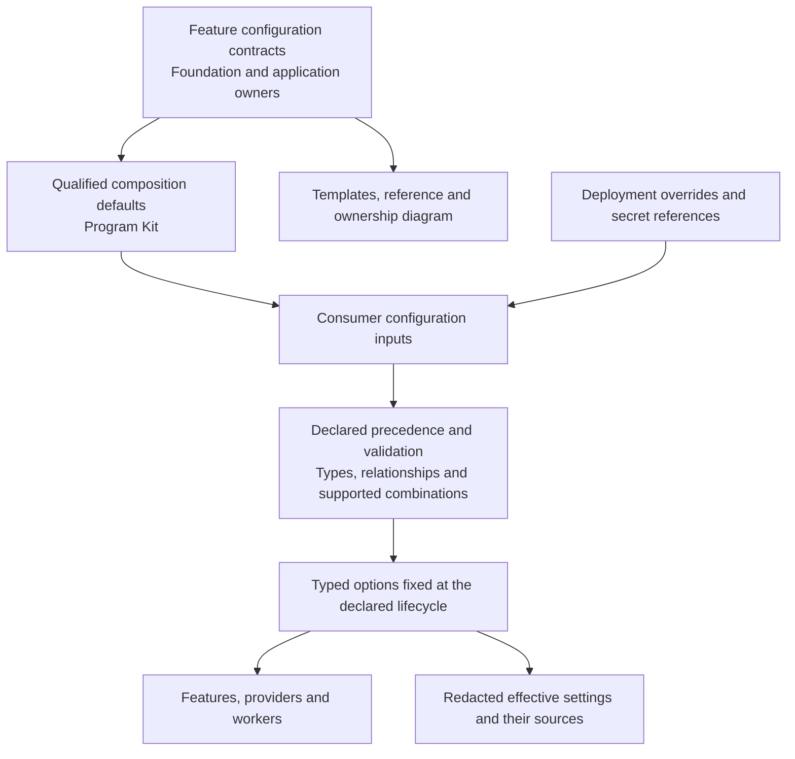

# Reusable consumer foundations and configuration implementation plan

Date: 2026-10-10. Scope accepted through the architecture interview. Concrete implementation plan ready for review; this document does not start implementation or publication.

Program Kit will deliver a runnable, qualified foundation for supported compositions so that the first feature concentrates on product behavior. It will generate configuration and binding scaffolds, supply reusable test infrastructure, and expose an architectural view of configuration. Foundation will own shared runtime mechanisms. Consumers will own their product contracts and outcomes.

The first supported compositions are the published Foundation host with BFF cookie authentication and Keycloak, and the same baseline with EF/PostgreSQL. The database variant adds provider configuration, lifecycle/migration scaffolding and reusable provider checks. Applications explicitly define transaction contents, conflict outcomes, ownership and replay semantics. Richer behavior packages can follow once their contracts are defined.

**Accepted constraints**

- Materialization and preparation must produce a composition that builds, runs and passes its applicable prewritten platform setup checks before dependent product implementation.
- The fast path supports versioned, qualified compositions and an explicit configuration envelope. Unsupported combinations need bounded additional qualification.
- Shared mechanics and test infrastructure remain maintained dependencies or tooling. Generated consumer code stays small and owns product adapters.
- Consumers inherit component proof, run maintained checks of their actual integration, and author tests for new product behavior or customization.
- Deployment and operational choices use cohesive typed configuration. Protocol identities and compatibility-sensitive product rules retain controlled change mechanisms.
- Configuration is validated and fixed per shell activation by default. Settings may reload only when their owner explicitly supports the transition.
- Configuration templates, reference, ownership/flow diagrams and a redacted effective-settings view derive from the same contracts. Relevant agent responses link these artifacts.
- New consumers are the first delivery target. Migration is proven with disposable Notes reproductions and documented for explicit consumer adoption.
- Acceptance requires zero newly authored generic test-harness code and no blanket foundation barrier before product work. Warm and cold preparation are measured separately before setting a timing target.

**Evidence and existing work**

Notes schedules ten setup tasks and thirteen foundational tasks before its first user story. Those tasks combine project/harness construction, external qualification and real product semantics. Its [task list](../../Orbyss/temp-tests/notes_app/specs/001-capture-private-notes/tasks.md) is the diagnosis example; it is not the specification for a universal starter.

De Sportomgeving supplies a second, newer consumer reference. Its installed governance, .NET and building-block extensions report 0.12.10, while Notes' governance extension reports 0.12.9; both retain Foundation 0.3.1. Its [task list](../../Orbyss/temp-tests/de-sportomgeving/specs/001-az-max-agenda-nieuws/tasks.md) still has nine setup tasks and eleven foundational tasks before the first story. The installed upstream task template explicitly prohibits any story before the foundation phase, while the implementation skill directs vertical outcomes. This confirms a conflicting installed instruction, beyond missing executable templates. The active consumer task remains in progress; this snapshot is design evidence, not completed application acceptance.

The newer consumer also supplies positive examples: [WebAdapter](../../Orbyss/temp-tests/de-sportomgeving/src/Persoonlijk/Toegang/WebAdapter.cs) uses Foundation response metadata for private documents and immutable assets; tasks explicitly prohibit duplicated publisher tests; its native runner is xUnit/MTP; and worker settings are typed and externally bound. Avoid treating these mechanisms as absent or prescribing the Notes executable runner universally. Remaining custom infrastructure includes [PostgreSQL provisioning/restart](../../Orbyss/temp-tests/de-sportomgeving/tests/Runtime/Fixtures/ProviderEnvironment.cs), Keycloak provisioning and published-host composition fixtures. Operational HTTP/owner budgets still reside in classes, while JSON admission requirements pin some capacity intervals to one value. Distinguish intentional contract bounds from settings whose claimed configurability is ineffective.

The current identity work revealed the need to distinguish the public authentication issuer from the internal administration address; the consumer now has a [regression for that distinction](../../Orbyss/temp-tests/de-sportomgeving/tests/Persoonlijk/IdentityProviderReconciliationTests.cs). Its provisioning/reset/revocation/removal protocol, durable leases, fencing and lost-acknowledgement recovery are application behavior built on Foundation administration ports. Reuse the provider fixture mechanisms; keep those product outcomes outside the mandatory login baseline.

Program Kit already provides engineering assets and reusable web tests through the [.NET managed manifest](../extensions/program-kit-dotnet/templates/dotnet/managed-files.json) and [secure web profiles](../extensions/program-kit-dotnet/references/secure-web-profiles.md). Its current [bootstrap contract](../extensions/program-kit-governance/references/bootstrap-lifecycle.md) establishes an initialized reviewed baseline. Add a separately observable foundation-readiness outcome; do not redefine historical bootstrap completion as proof of a runnable application.

Selected public Foundation 0.3.1 already has named response policies for CSP, referrer, browser permissions, cache lifetime and indexing. Its selected knowledge source and inspected WebDefaults source hashes match. The missing work includes exposing these policies through composition templates, separate nofollow support and a supported seam for dynamic response contributions where required. See the [selected knowledge index](../extensions/program-kit-building-blocks/references/dependency-profiles/candidates/foundation-0.3.1-build-0.3.1-exporter-0.2.5-forms-0.2.1-localization-0.1.2/knowledge/index.json).

The completed work in “Analyze RM-01 test workflow” supplies lifecycle knowledge, feature-owned initialization guidance, selected-root packaging, test-owner replacement and browser durability guards. Its reported bounded Development run passed 82/84 checks; the two integration failures were repaired and passed targeted reruns. This is supplementary development evidence, not a clean complete Release result. Incorporate the current implementation and [migration guide](maintenance/application-lifecycle-repair.md), review its final diff, and rerun only checks affected by integration changes.

Existing [Foundation consumer-contract work](foundation-consumer-contracts-implementation-plan-2026-10-06.md) includes private Execution/PostgreSQL contracts and a Notes conformance fixture. Reuse and assess that work before adding another implementation. Development-qualified packages do not establish public availability or inclusion in the selected public composition.

**Responsibilities and configuration flow**

| Owner | Responsibility |
| --- | --- |
| Foundation | Runtime response policies, approved dynamic contributions, shared provider mechanisms, typed feature configuration and source-backed metadata |
| Program Kit | Composition recipes, deterministic materialization, configuration templates/reference/views, supported-input validation, reusable setup and test orchestration |
| Application | Resource classification, product policy, semantic bindings, schema/migrations, transaction contents and observable outcomes |
| Deployment | Origins, service addresses, secret references, environment configuration and application of controlled changes |

Use the existing settings metadata model: path, owner/scope, type, default, constraints, binding, precedence, secret classification and reload semantics. Add composition membership and qualification references through existing profile/recipe contracts where possible. Describe effective source precedence accurately, including application inheritance, shell overrides and deployment providers; do not assume a universal precedence that differs from the selected runtime.

Operational values include timeouts, retry limits, batch sizes and worker pacing. Product policy changes such as retention generations must use their accepted transitions. Schema versions, digest formats, operation identities and lock identities remain stable owned constants. Mandatory privacy/security behavior cannot be disabled through an incidental setting. Public browser configuration is a validated allowlist of application settings; it contains no server credentials or signing material.

**1. Integrate lifecycle corrections and establish the baseline**

Review the completed lifecycle/packaging work and identify its maintained entry points: exact selected publisher knowledge, provider-owned Prepare initialization, application-owned startup/workers, selected-root packaging and predecessor/successor test ownership. Preserve legitimate selection presets and the pure-library `Build.ps1 -RootPackage` path. Templates must not introduce an aggregate library, consumer host executable or derived host image solely to gather dependencies or orchestrate feature-owned tasks.

Capture a reproducible baseline of the current foundation setup in a disposable repository. Record the selected dependency profile, actual outputs and preparation durations. Use actual package consumption and runtime activation. Existing Notes remains a read-only reference; its accounts, private configuration, databases and accepted history are outside implementation writes.

Completion: the next tranche has a stable integration boundary and a baseline against which authoring and elapsed-time reductions can be measured.

**2. Complete the necessary Foundation contracts**

Audit the current Foundation checkout, repository instructions and exact selected/candidate APIs before editing. Preserve the existing named-policy ownership and validation model. Add typed crawler policy support sufficient to express noindex and nofollow coherently; define precedence for private resources, errors and resource-level restrictions. Keep one final response-policy writer, including authentication errors and non-HTML responses within its pipeline scope.

Provide a supported response-local CSP contribution seam for the editor use case if no existing public seam meets it. Foundation owns nonce creation and final policy composition; the application requests an admitted capability and receives the response-local value needed for markup. Explicit policy denial remains denial. Static configuration must not carry a reusable nonce or permit arbitrary middleware to weaken protected directives.

Audit configuration binding, activation validation and metadata for the selected features. Close concrete inconsistencies using existing options and shell lifecycle mechanisms. Reuse the existing provider/deadline candidate where suitable; publicly qualify it before promising that API in a public PostgreSQL composition. Add only missing generic provider mechanics, keeping schema, transaction contents and product outcome mapping application-owned.

Completion: packaged tests exercise policy precedence, crawler rules, errors/private caching, dynamic contributions and denial, shell isolation, configuration validation and relevant provider lifetime behavior. Foundation acquires no runtime dependency on Program Kit.

**3. Define qualified compositions and configuration contracts**

Extend the existing dependency selection and materialization contracts with a finite composition descriptor. Bind each supported variant to exact packages, host digest, activation identities, toolchains, concrete target roles, configuration contracts, test capabilities and qualification scope. Keep independent package versions visible.

Introduce coherent BFF deployment inputs using the existing typed SPA input/rendering approach as a reference. Derive application callback/logout locations, Keycloak client redirect settings, allowed origins and test targets from the same public-origin/path inputs. Separate the local synthetic identity fixture from production identity provisioning. Document existing-realm updates, TLS/proxy requirements and secret references rather than treating a realm import file as an update mechanism.

Model the public identity authority separately from any private Keycloak administration/backchannel address. Validate their intended realm/client relationships without equating an issuer to a transport URL. Include distinct-address configuration cases and matching tests; application identity adapters must consume the declared public identity rather than reconstruct it from an administration endpoint.

Define supported theme customization: maintained theme selection and admitted branding changes are distinct from custom provider templates or behavioral code. Bind assurance to the tested artifacts and customization rules. Parameter validation and relational rules establish admissibility; identify representative/boundary tests honestly without claiming exhaustive testing of every possible value.

Completion: validation rejects inconsistent callbacks/origins, unsupported activations and conflicting settings before dependent product work. The supported envelope and invalidation conditions are explicit.

**4. Materialize the runnable foundation deterministically**

Extend existing sync/materialization and managed-file ownership, avoiding a second bootstrap or upgrade framework. Generate minimal projects for the accepted responsibilities, feature registration seams, configuration binding/validation scaffolds and test adapters. Core, API, implementation and provider boundaries appear only where the accepted design requires them. Add no default Identity or Composition layer without a real responsibility.

Derive configuration templates from authoritative defaults and constraints. Avoid separately maintained defaults in constructor parameters, manual readers, JSON templates and documentation. Verify metadata against actual binding behavior. Preserve consumer-owned content; report drift/conflicts through existing preview/apply and upgrade flows. Interrupted preparation and repeat execution must resume safely and must not overwrite customizations or silently advance captured dependency profiles.

Derive runtime directories and configuration paths from accepted selected targets through maintained tooling, replacing the need for consumer-specific canonical-path resolvers. Cover both root and nested runtime layouts. Expose exact capacity requirements as fixed constraints when intentional; do not advertise an operator override that the registered contract rejects, or loosen a product wire limit to make a template pass.

The database variant supplies provider lifecycle and migration seams. Before application schema exists, readiness proves provider connectivity and selected generic behavior; it does not claim product migrations or transaction semantics have been implemented. Synthetic probing stays in disposable test fixtures, outside the production feature selection.

Completion: both compositions can be reproduced without an agent authoring generic plumbing. Reruns are safe, actual runtime package roots are correct, and production artifacts contain no test-only capabilities.

**5. Supply shared tests and define evidence reuse**

Maintain generic harness reporting/filtering, disposable provider lifecycle, readiness polling, restart and connection-fault injection once. Preserve supported consumer runner adapters; do not require a runner migration merely to obtain shared fixtures. Package stable reusable C# mechanics in test-only support where warranted and retain orchestration in Program Kit tooling. Determine names and packaging from the existing component boundaries during implementation review.

Keep exhaustive component protocol tests upstream. Consumers use maintained configuration/binding checks and a small browser/provider setup check for their actual environment. Add application adapters and cases for real owner predicates, transaction atomicity, conflict outcomes, uncertain commits and recovery only when those capabilities apply. A generic race test cannot establish an application's lock order or replay semantics.

Declare evidence dependencies on exact package/template bytes, selected profile, relevant configuration, theme customization, setup inputs and environment. Reuse successful results only for unchanged relevant inputs. Deployment changes require relevant setup checks; application changes require affected behavior checks; a customization outside the qualified envelope requires targeted new qualification. Failed/interrupted results and empty selections establish no acceptance.

Reconcile existing first-code/web/persistence obligations to this division of proof explicitly through their normal maintenance path. Preserve mandatory coverage and release gates. Do not require a new receipt or narrative dossier at each implementation checkpoint; use existing evidence artifacts and compact progress state.

Completion: two independent generated consumers use the same maintained fixtures without copied harness implementations. Their application-specific failures remain observable, and evidence reuse cannot hide changed inputs or historical failures.

**6. Expose configuration to architects and development workflows**

Generate a concise reference and Mermaid diagram showing feature ownership, scopes, sources/precedence, lifecycle and dependencies. Add a read-only effective-settings view with redaction and per-setting provenance. Export only supported public browser settings. Keep secret values out of documents, logs and generated diagrams.

Agent guidance links the existing view when configuration materially affects a design, reports relevant overrides, and records why a value is tunable or contract-bound. Regenerate views when their source contracts or composition change and validate their consistency. Keep substantive decisions in the existing plan/ADRs; add no parallel approval ledger.

Completion: an architect can determine a value's owner, effective source, constraints and change procedure without reading implementation classes.

**7. Prepare readiness and begin product slices**

Integrate an observable foundation-readiness check with supported setup entry points. It validates selected inputs, restore/build, actual feature activation, applicable services and maintained setup tests, then reports named failures or readiness. Keep file-generation success, platform readiness and product acceptance distinct.

Do not automatically start services during task drafting, ordinary hooks or intake. Service preparation follows the existing authorized setup contract; interactive bootstrap/intake ownership remains unchanged. Configuration and runtime failures identify the concrete repair rather than creating a generic compatibility research phase.

Task generation consumes the actual ready baseline. Schedule remaining enabling work beside the first operation that needs it. Preserve real security/storage prerequisites while removing the universal foundation barrier. The first product proving slice for a Notes-like test consumer creates and reads an owned resource through real HTTP/authentication/PostgreSQL. It proves product bindings without importing Notes' full draft/retention/replay protocol.

Verify the installed preset, merged task template and implementation skill together. Source-level vertical-slicing guidance is insufficient if the consumer still receives the upstream instruction that every foundation task must precede every story. Installation/upgrade fixtures must expose the corrected operation-based instructions while retaining genuinely due security, provider and authority gates.

Completion: supported consumers start product implementation with reusable foundation obligations already satisfied, and their first vertical operation remains independently testable.

**8. Prove migration, performance and public adoption**

Use fresh disposable repositories for both compositions and disposable Notes reproductions for migration. Preserve accepted architecture history, profiles, native locks, custom configuration and synthetic persisted data. Exercise reviewed upgrade/conflict handling, feature removal, selected-root packaging, restart and retained-data checks. Provide instructions for explicit existing-consumer adoption; live Notes migration is a separate consumer action.

Add a disposable comparison case derived from De Sportomgeving's boundaries: a nested runtime layout, the existing xUnit/MTP adapter, multiple independently owned feature registrations, and distinct public issuer/private administration addresses. It need not reproduce the sport/news imports or account-lifecycle product. Preserve the active De Sportomgeving repository as read-only reference. This second shape verifies that the foundation templates generalize beyond the Notes layout and test runner.

Measure cold preparation and prepared-machine runs, separating generation, dependency acquisition/restore, build, service readiness and tests. Record total time to the first working product operation, plus newly authored generic harness code and remaining setup tasks. Define a numeric timing target after the prototype establishes a defensible baseline. Moving work into bootstrap alone does not count as a reduction.

Develop against explicit candidate profiles as necessary. Public composition adoption follows approved Foundation publication, immutable package/host availability and fresh exact-composition qualification. Then regenerate Program Kit's selecting profile and versioned knowledge together. Preserve historical profiles/evidence and consumer locks. Run the dependency update workflow before selecting a release candidate; register newly introduced dependencies in maintenance-policy.json.

Completion: the public catalog selects only available, qualified combinations; migration and timing evidence support the declared promise.

**Validation and execution boundaries**

Run meaningful targeted validators during each behavioral tranche, then the bounded Program Kit Development suite for integrated changes. Use actual selected lifecycle mechanisms and real PostgreSQL where the claim requires them. Exercise invalid configuration and callback relationships, header/nonce denial, isolation, races, cancellation/drain, restart, partial preparation, upgrade conflict and stale-input reuse rejection.

Local browser validation uses Chromium and WebKit. Keep Firefox in CI under the known Windows limitation. Complete Release remains a publication gate after the user selects a candidate for publication. On this host the user runs the complete Release command in a user-owned terminal unless explicitly authorizing the repository's dedicated local-Release override. No paid worker phase is part of this plan.

The first implementation tranche is baseline integration plus the Foundation response/configuration contract audit and its concrete missing behavior. The next tranche establishes composition inputs and a minimal runnable generator; shared verification, architectural views and product-workflow integration follow. Migration/performance/public qualification complete the scope. Exact API names and release versions are implementation choices to resolve against current source; a materially broader capability or changed product guarantee returns to architectural review.

Implementation completion requires the generated code, configuration, source-backed reference/diagram, effective-settings view, reusable tests, migration instructions and qualification artifacts to agree. Publication completion additionally requires the approved release workflows. This plan creates neither publication authority nor a claim that an existing consumer has migrated.
