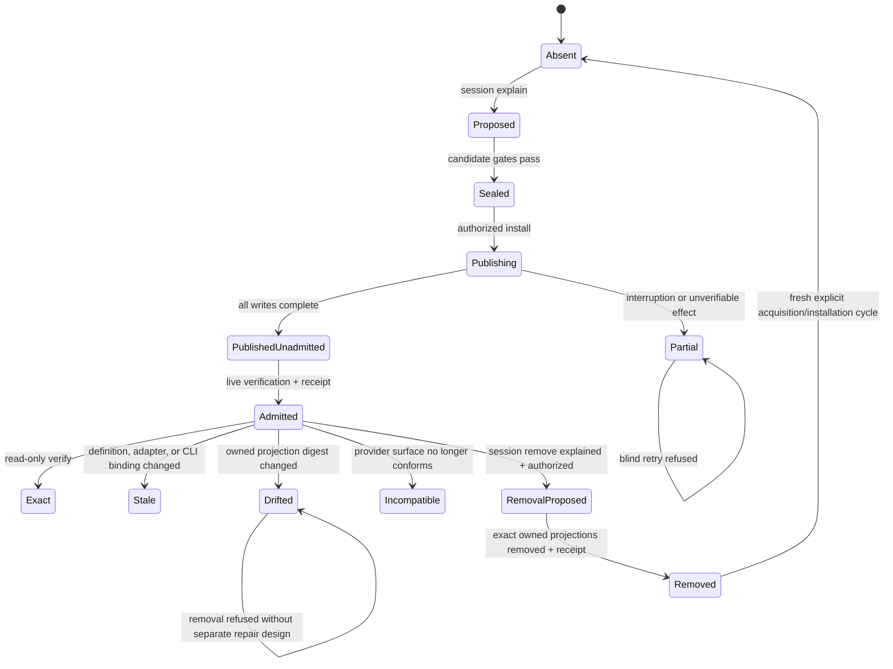

# Data Model: Independent CLI Distribution and AI-Session Integration Proof

**Feature**: `002-session-integration-proof`
**Canonical profile**: `program-kit.canonical-json/v1`

## Modeling Rules

- Every governed record has an authority-qualified identity, exact revision,
  canonical profile, and SHA-256 content digest.
- Canonical records contain repository-relative logical paths only. Absolute
  host paths, credentials, transcripts, and raw external output are evidence
  inputs that must be withheld or reduced to safe observations.
- Provider installation, CLI presence, projection discovery, selection,
  compatibility, activation, trust, and authority are distinct states.
- The independently acquired CLI is an exact external input. The session
  integration records its identity but does not own or remove it.
- Provider projections, journals, and installation records are
  `generated-owned`. Existing provider and consumer material is
  `consumer-owned` unless an exact admitted record proves otherwise.
- Actual human authorship of a grant is a human-review claim. Machine-enforced
  authority is limited to the exact grant artifact, its declared issuer
  assurance, bindings, validity, scope, and currentness.

## Entity: CLI Release Identity

Represents the exact independently acquired command that the session adapter
may invoke.

| Field | Meaning | Validation |
|---|---|---|
| `schema` | Record family | Exactly `program-kit.cli-release-identity/v1` |
| `canonicalProfile` | Canonical byte profile | Exactly the supported v1 profile |
| `packageId` | Distribution identity | Exactly selected, case-normalized package identity |
| `packageVersion` | Selected package version | Exact version; no range, tag, or floating label |
| `packageSource` | Attributable source identity | Exact governed source; no ambient source aggregation |
| `packageDigest` | Observed package bytes | SHA-256 of the acquired package |
| `commandName` | Public executable name | Exactly `program-kit` for this profile |
| `workspaceRelativeExecutable` | Installed command location | Normalized path inside the selected workspace |
| `executableDigest` | Observed command bytes | SHA-256 of the callable app host or launcher |
| `reportedVersion` | Structured CLI self-report | Must equal `packageVersion` for the selected release |
| `runtimeProfile` | Required host runtime | Exact reviewed runtime identity |
| `claimClass` | Strength of distribution claim | `verified-equivalent`; never upgraded to canonical-byte without proof |

The package digest and executable digest are separate observations. Equal
versions with different package bytes are incompatible until explicitly
reviewed; version equality does not establish byte identity.

## Entity: Canonical Session Integration Definition

Provider-neutral source of truth for using Program Kit in a human-led AI
session.

| Field | Meaning | Validation |
|---|---|---|
| `schema` | Contract family | Exactly `program-kit.session-integration-definition/v1` |
| `canonicalProfile` | Canonical byte profile | Exact supported profile |
| `identity` | Governed definition identity | Authority, kind, name, revision, digest |
| `operationContracts` | Existing public operations available to sessions | Exact identities for `explain`, `construct`, and `evaluate` |
| `sessionLifecycleContracts` | Setup lifecycle operations | Exact identities for session `explain`, `install`, `verify`, and `remove` |
| `authorityRules` | Rules for identity-forming and effect-bearing choices | Must preserve human authority and request binding |
| `effectClasses` | Read-only and committed classifications | No adapter may weaken an effect-bearing operation to read-only |
| `resultRules` | Authoritative structured fields | Requires machine fields and diagnostic identities, not prose parsing |
| `guidanceArtifact` | Provider-neutral session workflow | Exact artifact identity and digest |
| `projectionRequirements` | Minimum provider behavior | Working scope, invocation, disclosure, reload, and compatibility rules |
| `diagnosticCatalogs` | Required stable diagnostic sources | Exact identities and revisions |

The definition links public factory operation contracts; it does not copy their
schemas or invent consumer semantics.

## Entity: Session Provider Manifest

Declares how one explicitly selected first-party adapter projects the canonical
definition to one provider surface.

| Field | Meaning | Validation |
|---|---|---|
| `schema` | Contract family | Exactly `program-kit.session-provider-manifest/v1` |
| `providerIdentity` | Provider integration surface | Exact authority-qualified identity |
| `adapterIdentity` | Executable adapter | Exact first-party identity, revision, and distribution binding |
| `definitionBinding` | Canonical definition supported | Exact identity, revision, and digest |
| `bindingKind` | Invocation mechanism | Exact supported kind; Codex uses `shell-cli` |
| `supportedScopes` | Installation scopes | Exactly `workspace` in this feature |
| `projectionDescriptors` | Owned provider artifacts | Logical path templates, media type, ownership, and claim class |
| `providerSurface` | Required discovery and reload semantics | Exact tested surface revision and declared limitations |
| `requiredCliOperations` | Program Kit operations preserved | Must equal the mandatory canonical set |
| `diagnosticCatalog` | Provider-specific failures | Exact provider catalog identity and revision |
| `conformanceProfile` | Mandatory adapter evidence | Exact profile and fixture set |
| `supportClaim` | Current compatibility status | `supported`, `incompatible`, or `not-evaluated`; no best effort |

Installed or discoverable manifests are unavailable until explicitly selected
and admitted for the request.

## Entity: Session Integration Request

Exact request submitted to one session lifecycle operation.

| Field | Meaning | Validation |
|---|---|---|
| `schema` | Request family | Exactly `program-kit.session-integration-request/v1` |
| `canonicalProfile` | Canonical byte profile | Exact supported profile |
| `operation` | Requested lifecycle operation | `explain`, `install`, `verify`, or `remove` |
| `evaluationContext` | Approved instant and environment observation | Explicit; no ambient clock in identity |
| `workspaceIdentity` | Target consumer workspace | Exact governed identity plus verified root binding |
| `scope` | Configuration scope | Exactly `workspace` |
| `providerSelection` | Exact provider and adapter | One provider, adapter, definition, and conformance profile |
| `cliRelease` | Exact independently installed CLI | Complete CLI Release Identity |
| `requestedEffect` | Requested mutation class | `none` for explain/verify; `committed` for install/remove |
| `expectedInstallationState` | Optimistic live precondition | Required for effect-bearing operations |
| `authorityGrant` | Exact grant artifact reference | Required and request-bound for install/remove; absent for read-only operations |

### Request identities

`requestCoreIdentity` is the canonical digest of the full request excluding
`authorityGrant`. An effect grant binds that digest, avoiding a circular digest
between request and grant. `requestIdentity` is the canonical digest of the
complete request, including the exact grant artifact reference when applicable.

The parser rejects unknown fields, duplicate identities, non-normalized paths,
effect/operation mismatches, implicit provider selection, and authority on a
read-only operation.

## Entity: Human Effect Grant

Reuses `program-kit.authority-grant/v1` with these mandatory session bindings:

| Binding | Requirement |
|---|---|
| Subject | Exact workspace identity and provider integration subject |
| Operation | Exact `session-install` or `session-remove` operation contract |
| Effect | Exactly `committed` |
| Request | Exact `requestCoreIdentity` |
| Conditions | Selected provider, adapter, definition revision, and workspace scope |
| Validity | Explicit approved instant range |
| Issuer assurance | Honest provider claim such as repository-record presence |
| Provenance | Exact consumer-owned approval record reference |
| Revocation | Exact local revocation reference |

The grant never implies that Program Kit authenticated a person. Human review
owns that claim.

## Entity: Projection Artifact

One provider-local output proposed by an adapter.

| Field | Meaning | Validation |
|---|---|---|
| `logicalPath` | Workspace-relative target | Normalized, inside workspace, no reparse traversal |
| `mediaType` | Artifact format | Exact declared type |
| `ownership` | Mutation ownership | Exactly `generated-owned` for this feature |
| `producerIdentity` | Exact provider adapter | Must match selected manifest |
| `definitionBinding` | Canonical source | Exact definition identity and digest |
| `contentDigest` | Candidate bytes | SHA-256 after deterministic projection |
| `claimClass` | Strength of claim | `canonical-byte` only inside the exact projection profile |
| `removalPolicy` | Safe lifecycle rule | Remove only when current digest equals admitted digest |

The Codex adapter initially proposes:

- `.agents/skills/program-kit/SKILL.md`; and
- `.agents/skills/program-kit/agents/openai.yaml` when UI metadata is included.

The adapter owns the dedicated `program-kit` skill directory only when the
complete directory was absent at preflight and the installation is admitted.

## Entity: Integration Candidate Set

Immutable complete set before live publication.

| Field | Meaning | Validation |
|---|---|---|
| `installationIdentity` | Exact proposed integration | Derived from request core, definition, adapter, CLI, and workspace |
| `candidateRoot` | Same-volume staging root | Internal, protected, and not emitted as an absolute public path |
| `artifacts` | Ordered Projection Artifacts | Unique logical paths, ordinal ordering |
| `setDigest` | Complete canonical manifest digest | Recomputed before publication |
| `state` | Candidate lifecycle | `draft`, `sealed`, `evaluated`, or `rejected` before publication |
| `gates` | Mandatory integrity evaluations | All applicable gates must be passed; not-evaluated blocks |

The set contains only provider projections. The external CLI and consumer-owned
authority records are referenced inputs, not candidate outputs.

## Entity: Session Publication Journal

Namespaced durable mutation record owned by the kernel publication primitive.

| Field | Meaning | Validation |
|---|---|---|
| `schema` | Journal family | `program-kit.session-publication-journal/v1` |
| `installationIdentity` | Candidate being published | Exact candidate binding |
| `operation` | `install` or `remove` | Must match the authorized request |
| `expectedLiveState` | Pre-effect state digest | Rechecked immediately before writes |
| `operations` | Canonically ordered writes/deletes | Exact paths and expected/new digests |
| `completedOperations` | Durable progress | Ordered subset of operations |
| `state` | Publication status | `prepared`, `publishing`, `published-unadmitted`, `committed`, or `incomplete` |
| `observedLiveState` | Post-effect digest | Present only after complete verification |

An incomplete journal never proves admission or safe retry.

## Entity: Installation Record

Receipt-last authoritative record for one admitted provider integration.

| Field | Meaning | Validation |
|---|---|---|
| `schema` | Record family | `program-kit.session-installation-record/v1` |
| `installationIdentity` | Governed installation identity | Exact canonical digest and revision |
| `requestIdentity` | Complete authorized request | Exact binding |
| `requestCoreIdentity` | Effect grant subject | Exact binding |
| `workspaceIdentity` | Consumer target | Exact workspace binding |
| `scope` | Installation scope | Exactly `workspace` |
| `definition` | Canonical integration source | Identity, revision, and digest |
| `provider` | Selected provider and adapter | Exact manifest and conformance profile |
| `cliRelease` | Independently installed CLI | Exact identity and observed evidence |
| `projectionSet` | Generated-owned live set | Logical paths, digests, producer, ownership |
| `publication` | Complete journal and live-state evidence | Must prove committed bytes |
| `state` | Trusted lifecycle state | `admitted`, `drifted`, `stale`, `incompatible`, `partial`, or `removed` |
| `sessionAvailability` | Separate provider observation | `not-evaluated`, `reload-required`, `available`, or `unavailable` |
| `admissionReceipt` | Final trusted record digest | Written only after every mandatory gate and live verification passes |

Session availability cannot upgrade an unadmitted installation. An admitted
installation can validly require a fresh session.

## Entity: Integration Verification Result

Read-only current evaluation of the exact installation.

| Field | Meaning | Validation |
|---|---|---|
| `observedState` | Current lifecycle classification | `absent`, `exact`, `stale`, `drifted`, `incompatible`, `partial`, or `removed` |
| `installationBinding` | Record evaluated | Exact identity and receipt digest when present |
| `cliObservation` | Current executable identity | Safe version/digest comparison; no protected path disclosure |
| `projectionObservations` | Current artifact comparisons | One typed observation per admitted logical path |
| `providerObservation` | Discovery/reload compatibility | Separate from artifact exactness |
| `effectState` | Verification effect | Always `none` |
| `diagnostics` | Stable actionable findings | Canonical ordering and disclosure floor |
| `primaryDisposition` | Safest valid next action | `complete`, `retry`, `provide-input`, `request-approval`, `repair`, `revise`, or `stop` |

Verification never writes, removes, reloads, repairs, or adopts state.

## Entity: Session Operation Result

Uses `program-kit.operation-result/v1` rather than defining a competing public
envelope. The existing command and operation-contract fields gain the exact
session lifecycle identities. Session payloads use governed structured fields
for:

- selected definition, provider, adapter, scope, and CLI release;
- proposed or observed projection artifacts;
- installation state and session availability;
- actual changes and effect state;
- journal, installation, verification, and removal receipts; and
- neutral and provider-specific diagnostics.

Rendered text remains a projection of this machine-authoritative result.

## Entity: Live Session Review Record

Safe evidence created by an explicitly authorized independent reviewer after a
fresh real provider session.

| Field | Meaning | Validation |
|---|---|---|
| `schema` | Review family | `program-kit.session-review/v1` |
| `reviewerAttestation` | Human-owned review statement | Exact reviewer identity asserted outside Program Kit authority |
| `providerObservation` | Provider and tested version | Safe version identity only |
| `installationIdentity` | Integration under review | Exact admitted record binding |
| `trialIdentity` | One fresh-session trial | Unique non-secret identity |
| `expectedScenario` | Golden scenario identity | No prompt or transcript content |
| `observedOperations` | Operation identity sequence | No raw model text |
| `authorityBoundaryObserved` | Whether effect preceded approval | Boolean plus safe evidence reference |
| `finalOutcome` | Typed Program Kit outcome | Exact outcome, effect, and disposition |
| `limitations` | Honest unproven aspects | Required when any observation is incomplete |

The record cannot prove deterministic AI behavior. It is evidence-backed and
human-reviewed only for the exact observed trials.

## Relationships

```text
Canonical Session Integration Definition
        1 ─────── * Session Provider Manifest
        │                    │
        │                    └── produces Projection Artifact(s)
        │
        └── selected by Session Integration Request
                            │
CLI Release Identity ───────┤
Human Effect Grant ─────────┤
                            ▼
                  Integration Candidate Set
                            │
                    kernel publication
                            ▼
                    Installation Record
                            │
                ┌───────────┴───────────┐
                ▼                       ▼
    Integration Verification      Live Session Review
```

## Installation State Machine



`Exact`, `Stale`, `Drifted`, and `Incompatible` are read-only verification
classifications of an installation record. They never mutate it implicitly.

## Session Availability State

Session availability is orthogonal to installation trust:

```text
not-evaluated -> reload-required -> available
not-evaluated -> unavailable
available -> unavailable       (provider/session change)
```

Only a real fresh-session observation may establish `available`. Artifact
verification alone may establish at most `reload-required` or `not-evaluated`.

## Identity Derivation

The exact installation identity is the canonical digest of:

1. `requestCoreIdentity`;
2. workspace identity and workspace-local scope;
3. canonical integration definition identity, revision, and digest;
4. provider and adapter identities plus conformance profile;
5. CLI package ID, exact version, package digest, executable digest, and
   reported version;
6. normalized projection descriptors and their candidate digests; and
7. explicit evaluation context inputs that affect claims.

Ambient current time, PATH order, installed-provider discovery order, locale,
filesystem enumeration order, and current session state are excluded from
meaning. They are normalized, explicitly recorded observations, or rejected.

## Ownership Matrix

| Artifact | Classification | Owner | Removal behavior |
|---|---|---|---|
| Exact CLI package and workspace-local tool directory | External exact input | Distribution/bootstrap mechanism | Never removed by session integration |
| Canonical integration definition and guidance | Program Kit source-owned distribution input | Program Kit maintainers | Not copied as consumer authority |
| Provider manifest and templates | Program Kit source-owned distribution input | Provider adapter owner | Not consumer-owned |
| `.agents/skills/program-kit/**` | Generated-owned after admission | Session integration | Remove only at admitted digest |
| Session candidate, journal, installation record, receipts | Generated-owned | Kernel/session subsystem | Retained as governed lifecycle evidence |
| Authority grant | Consumer-owned | Human/consumer authority provider | Never edited or removed |
| Existing `.agents`, other skills, `AGENTS.md`, provider config | Consumer-owned | Consumer | Never edited, adopted, or removed |
| Generated application/component | Existing Feature 001 ownership rules | Consumer/factory profile | Unchanged by session integration lifecycle |

## Validation Invariants

1. Exactly one provider, adapter, definition revision, CLI release, workspace,
   and scope is selected.
2. Effect class matches operation; read-only operations reject grants and
   install/remove reject missing or stale grants.
3. Every effect grant binds `requestCoreIdentity`, subject, operation, effect,
   provider, scope, and explicit validity.
4. No provider projection can be canonical source truth or carry consumer
   semantics.
5. Every candidate path is normalized, inside the workspace, unique, absent or
   exact integration-owned, and free of reparse traversal.
6. Complete candidates are sealed and rehashed before any live write.
7. Any not-evaluated mandatory gate blocks publication or admission.
8. Admission receipt is written last and covers the complete observed live set.
9. Verification and explanation have `effectState: none` for every outcome.
10. Removal requires an exact admitted record and current projection digests;
    drift, absence, adoption, or uncertain ownership blocks deletion.
11. Provider incompatibility is never silently downgraded to guidance-only
    success.
12. The Program Kit source-authoring marker blocks consumer session lifecycle
    operations in this repository without a force or waiver path.
13. Results and evidence never contain secrets, transcripts, raw external
    output, unsafe commands, or protected absolute paths.
14. Generated consumer runtime dependency closure contains no session
    integration, provider adapter, skill, Program Kit, Spec Kit, or AI provider
    dependency.
