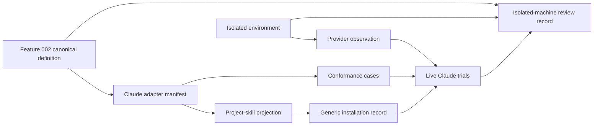

# Data Model: Claude Code Session Adapter

**Feature**: `003-claude-code-adapter`
**Canonical profile**: `program-kit.canonical-json/v1`

## Boundary

Feature 003 does not duplicate Feature 002's canonical session definition,
request, human effect grant, candidate set, publication journal, installation
record, verification result, or operation-result envelope. It adds exact Claude
Code provider identities, projection descriptions, conformance observations,
and isolated-machine evidence that reference those canonical entities.

Physical host paths, credentials, account identities, transcripts, raw provider
output, prompts, model reasoning, and absolute protected paths are never
governed evidence.

## 1. Claude Code Adapter Manifest

The exact first-party mapping from one canonical session integration revision to
one supported Claude Code project-skill surface.

### Fields

| Field | Meaning | Validation |
|---|---|---|
| `schema` | Manifest contract | Exact `program-kit.session-provider-manifest/v1` |
| `canonicalProfile` | Byte profile | Exact supported canonical profile |
| `providerIdentity` | Claude Code provider release | Exact authority, kind, name, revision; initial revision `2.1.220` |
| `adapterIdentity` | Program Kit Claude adapter | Exact first-party identity and revision |
| `definitionBinding` | Feature 002 canonical definition | Exact accepted identity; no floating range |
| `bindingKind` | Invocation transport | Exact `shell-cli` |
| `supportedScopes` | Installation scopes | Exactly `workspace` |
| `providerSurface` | Project-skill surface claim | Exact surface revision, discovery and reload behavior |
| `projectionDescriptors` | Complete owned projection set | Exactly the declared project-skill artifacts |
| `requiredOperations` | Canonical operation closure | Exact full operation set from Feature 002 |
| `diagnosticCatalog` | Claude-specific catalog | Exact identity and revision |
| `conformanceProfile` | Required evidence profile | Exact identity and revision |
| `supportClaim` | Current claim | `supported`, `incompatible`, or `not-evaluated` |

### Rules

- Provider identity, adapter identity, and definition binding are separate.
- The manifest cannot expand the canonical operation set or authority model.
- Support is exact to the declared provider release and surface.
- Installed, discovered, or authenticated provider state never selects this
  manifest ambiently.

## 2. Claude Code Project-Skill Projection

The complete provider-local capability that makes Program Kit discoverable to a
Claude Code session.

### Fields

| Field | Meaning | Validation |
|---|---|---|
| `identity` | Projection artifact identity | Exact governed identity |
| `logicalPath` | Workspace-relative location | Exact `.claude/skills/program-kit/SKILL.md` |
| `mediaType` | Content type | Markdown with YAML front matter |
| `contentDigest` | Exact canonical bytes | SHA-256 over UTF-8 bytes |
| `ownership` | Artifact class | Exact `generated-owned` |
| `producer` | Adapter identity | Exact Claude adapter revision |
| `definitionBinding` | Canonical source | Exact Feature 002 definition identity |
| `providerBinding` | Claude surface | Exact provider release and surface identity |
| `claimClass` | Reproducibility class | Exact `canonical-byte` |

### Required content

- Exact `name: program-kit` and a bounded discovery description.
- Canonical instructions for explanation, authority, construction, evaluation,
  typed results, diagnostics, remediation, runtime isolation, and stop cases.
- Provider-specific exact executable invocation mechanics only.

### Forbidden content

- `allowed-tools`, scripts, dynamic commands, executable remediation, provider
  credentials, consumer-domain semantics, planning workflows, approval
  statements, model selection, MCP, plugin, or global configuration.

## 3. Claude Code Provider Observation

A point-in-time observation of the separately managed provider on the isolated
machine.

### Fields

| Field | Meaning | Validation |
|---|---|---|
| `observationIdentity` | Canonical record identity | Derived from safe fields only |
| `evaluationContext` | Declared time/assurance | Approved declared instant |
| `environmentIdentity` | Isolated-machine binding | Exact safe machine profile identity |
| `providerIdentity` | Selected Claude Code release | Exact manifest binding |
| `reportedVersion` | `claude --version` result | Exact normalized version only |
| `executableDigest` | Observed executable bytes | Required; no physical path retained |
| `authenticationState` | Provider readiness | `not-evaluated`, `available`, or `unavailable` |
| `workspaceTrustState` | Provider trust observation | `not-evaluated`, `required`, `accepted`, or `rejected` |
| `skillDiscoveryState` | Current session observation | `not-evaluated`, `reload-required`, `available`, or `unavailable` |
| `limitations` | Safe bounded facts | Typed codes; no raw provider output |

### Rules

- Authentication and trust are observations, not Program Kit authority.
- `reportedVersion` must equal the selected exact provider revision for support.
- Provider availability cannot upgrade a drifted or invalid installation.

## 4. Isolated Consumer Environment Profile

The safe identity of the external test boundary.

### Fields

| Field | Meaning | Validation |
|---|---|---|
| `identity` | Environment identity | Canonical digest over safe profile |
| `osFamily` | Target family | `windows` or `linux` for the first profile |
| `osArchitecture` | Architecture | Exact supported value |
| `runtimeProfile` | Required .NET runtime | Exact identity |
| `workspaceIdentity` | Consumer repository | Exact governed identity and root binding |
| `cleanBoundaryClaims` | Required absences | Program Kit source, Spec Kit, Codex adapter, and prior session state absent |
| `toolBootstrapIdentity` | Sealed kit | Exact manifest and digest |
| `networkProfile` | Declared external use | Only separately managed acquisition/authentication/live-provider calls |

### Rules

- User names, hostnames, drive roots, and absolute paths are excluded.
- A failed clean-boundary check blocks the isolated-machine claim.
- Source code for Program Kit cannot be present in the consumer workspace or
  review kit.

## 5. Claude Code Conformance Case

One provider-neutral scenario evaluated through a Claude-specific projection.

### Fields

| Field | Meaning | Validation |
|---|---|---|
| `caseIdentity` | Stable scenario | Exact corpus identity and revision |
| `canonicalOperation` | Intended public operation | Exact Feature 002 operation identity |
| `requestIdentity` | Canonical request | Exact digest |
| `expectedScope` | Working boundary | Exact workspace identity |
| `expectedEffect` | Maximum/actual effect | Exact canonical classifications |
| `expectedDisposition` | Required response class | Exact canonical disposition |
| `expectedDiagnostics` | Stable diagnostic identities | Ordered exact list or bounded set |
| `providerInvocation` | Normalized Claude binding | Arguments as array; no shell command string |
| `observedResultIdentity` | Program Kit result | Exact digest when available |
| `providerObservation` | Provider behavior | Safe classification only |
| `status` | Case verdict | `passed`, `failed`, `incompatible`, or `not-evaluated` |

### Rules

- Provider prose cannot select `passed`.
- Canonical operation, scope, arguments, effect, outcome, disposition, and
  diagnostic meaning must be preserved.
- Representational loss is `incompatible`, not approximate success.

## 6. Live Claude Code Trial

One fresh-provider-session observation on the isolated consumer machine.

### Fields

| Field | Meaning | Validation |
|---|---|---|
| `trialIdentity` | Trial identity | Exact profile, corpus, provider and ordinal |
| `ordinal` | Trial number | Integer 1 through 10 |
| `mode` | Provider interaction | `explicit-skill`, `natural-discovery`, or `interactive-review` |
| `freshSession` | Session isolation claim | Must be true |
| `providerObservation` | Exact provider observation | Required reference |
| `inputCase` | Agreed safe case | Exact conformance-case reference |
| `programKitResults` | Actual CLI evidence | Exact safe result/evidence references |
| `workspaceEffects` | Independent effect observation | Exact before/after set identity |
| `authorityBehavior` | Grant handling | `preserved`, `violated`, or `not-evaluated` |
| `diagnosticBehavior` | Typed result handling | `preserved`, `violated`, or `not-evaluated` |
| `trialStatus` | Outcome | `passed`, `failed`, `incompatible`, `inconclusive`, or `not-evaluated` |
| `reviewerAttestation` | Human review reference | Required for final accepted live proof |

### Rules

- Raw print-mode output and transcripts are discarded after bounded parsing.
- A provider-reported success cannot override actual Program Kit results or
  filesystem evidence.
- Missing credentials, network, trust, or provider availability produces
  `not-evaluated` or `inconclusive`, never `passed`.

## 7. Isolated-Machine Review Record

The safe aggregate returned from the external machine.

### Fields

| Field | Meaning | Validation |
|---|---|---|
| `schema` | Evidence contract | Exact `program-kit.claude-code-machine-review/v1` |
| `canonicalProfile` | Byte profile | Exact supported profile |
| `reviewIdentity` | Aggregate identity | Canonical digest over record core |
| `evaluationContext` | Declared review time | Exact safe context |
| `reviewKit` | Sealed handoff | Exact manifest/digest |
| `environment` | Isolated machine | Exact environment profile reference |
| `cliRelease` | Program Kit release | Exact Feature 002 CLI identity |
| `definition` | Canonical session meaning | Exact accepted identity |
| `adapter` | Claude adapter | Exact identity |
| `provider` | Claude Code | Exact release identity |
| `installation` | Integration state | Exact installation record reference |
| `conformanceSummary` | Deterministic/provider cases | Counts by status and corpus identity |
| `liveTrials` | Ten trial summaries | Exactly 10 when review claimed complete |
| `runtimeIsolation` | Generated app proof | Exact evidence reference and verdict |
| `disclosureReview` | Safe evidence check | Required verdict |
| `humanDecision` | Product review | `accepted`, `rejected`, or `pending` |
| `limitations` | Honest boundaries | Non-empty when anything is not evaluated |

### Rules

- `accepted` requires all mandatory deterministic gates, no unauthorized effect,
  complete required trials, runtime isolation, and disclosure review.
- `accepted` is a human product decision, not an automatic provider result.
- The record contains no credentials, provider transcript, prompt, model
  reasoning, raw exceptions, physical protected paths, or unsafe commands.

## Relationships



## State Transitions

### Adapter support

```text
not-evaluated
  -> supported       (all mandatory deterministic conformance gates pass)
  -> incompatible    (provider surface cannot preserve a mandatory boundary)

supported
  -> stale           (selected provider or canonical revision changes)
  -> incompatible    (fresh evidence disproves a support claim)
```

### Live review

```text
pending
  -> running
  -> passed          (complete trials + independent evidence + human acceptance)
  -> failed          (a required behavior is violated)
  -> incompatible    (provider cannot preserve a mandatory contract)
  -> inconclusive    (observations are incomplete or contradictory)
  -> not-evaluated   (provider prerequisites unavailable)
```

No state automatically transitions to `passed` because a provider returned
successful prose or because deterministic tests are green.

## Ownership Matrix

| Artifact | Owner | Class | Removal behavior |
|---|---|---|---|
| `.claude/skills/program-kit/SKILL.md` | Claude adapter | `generated-owned` | Remove only at exact admitted digest |
| `.claude/` and `.claude/skills/` parents | Consumer | `consumer-owned` | Never remove merely because empty |
| `.program-kit/session-integrations/claude-code/` records | Session subsystem | `generated-owned` | Preserve lifecycle evidence per generic contract |
| Workspace-local Program Kit CLI | External bootstrap | Independently managed | Never remove |
| Claude Code executable/config/authentication | Developer/provider | Independently managed | Never modify or remove |
| Consumer requests and grants | Consumer/human authority | `consumer-owned` | Never rewrite |
| Generated application | Consumer after admitted construction | Existing Feature 002 classes | No Claude runtime coupling |

## Invariants

1. Claude-specific fields never enter provider-neutral canonical schemas.
2. The adapter cannot execute or admit against a different canonical definition
   than its exact manifest binding.
3. Skill discovery, provider permission, Program Kit authority, installation
   validity, and session availability remain separate facts.
4. The projected skill grants no Claude Code tool permission.
5. A live provider cannot create or widen a Program Kit grant.
6. Provider output cannot replace a Program Kit operation-result envelope.
7. Existing `.claude/skills/program-kit/` content is a collision unless exact
   prior admission proves ownership and bytes.
8. Removal never performs recursive name discovery and never removes parent
   directories owned by the consumer.
9. The external machine contains no Program Kit source, Spec Kit, Codex adapter,
   or prior session integration state when clean proof begins.
10. A live review without exact provider version, complete evidence, or human
    attestation cannot pass.
11. Generated applications contain no Program Kit, Spec Kit, Claude Code,
    provider adapter, skill, or authoring-state runtime dependency.
12. No governed artifact or evidence record contains credentials, secrets,
    transcripts, raw provider output, or protected physical paths.
